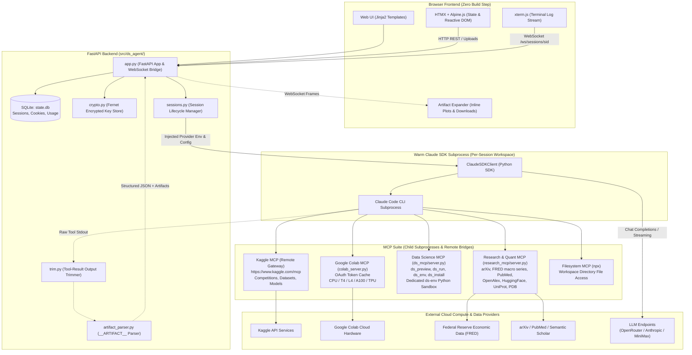
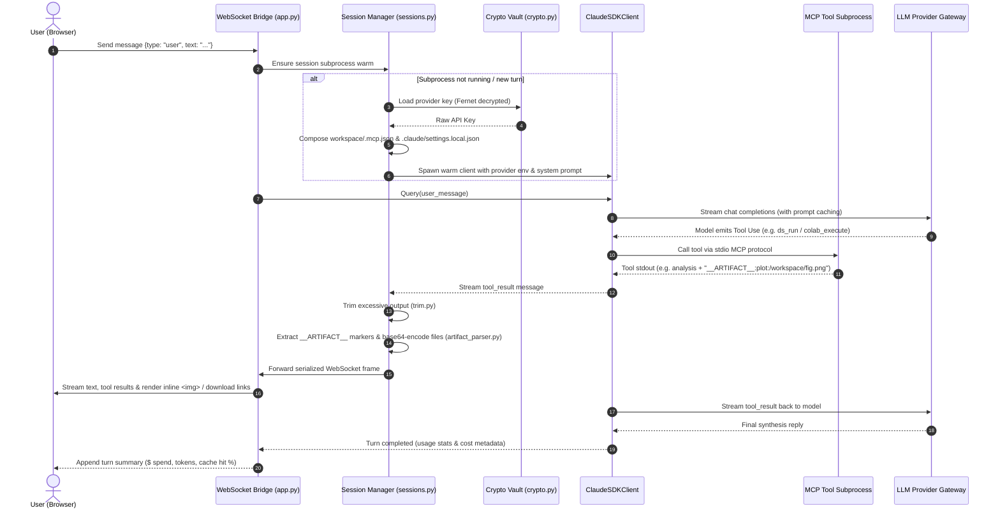
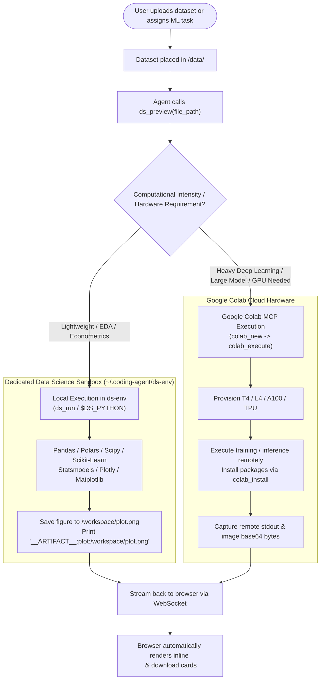
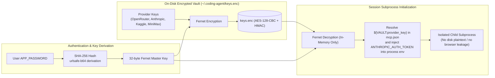
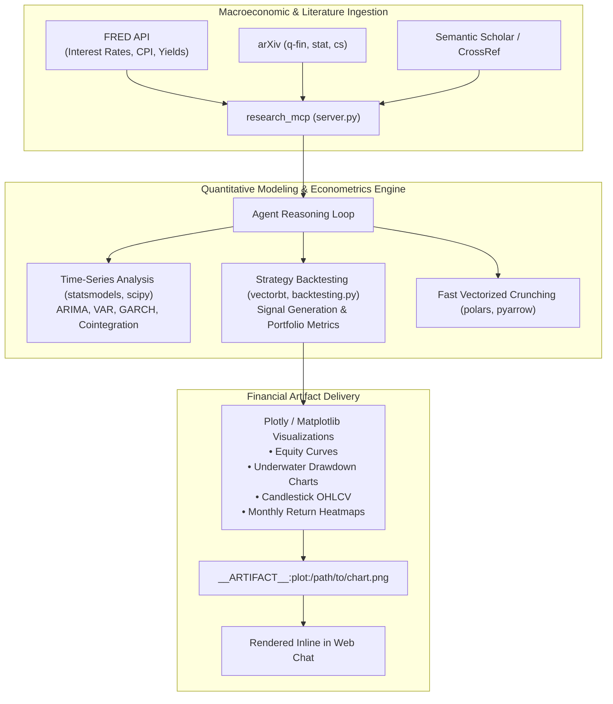

# Architecture & System Design

> Personal AI Data Science & Quantitative Research Agent server with BYOK (Bring Your Own Keys) and Model Context Protocol (MCP) integrations. Single-user, single-host, high-performance architecture hosting the Claude Agent SDK in the browser.

---

## 🏗️ 1. High-Level System Architecture

The following diagram illustrates the end-to-end topology from the browser client to the FastAPI server, Claude Agent SDK subprocess, MCP servers, and cloud compute runtimes:



---

## 🔄 2. End-to-End Session Execution Flow

When a user initiates a prompt in the chat, the system orchestrates key resolution, workspace rendering, tool invocation, and real-time artifact streaming:



---

## 📊 3. Data Science & Google Colab Workflow

The agent dynamically chooses between local sandboxed execution in `ds-env` and remote cloud acceleration in Google Colab:



---

## 🔐 4. BYOK Security & Key Vault Architecture

ds-agent guarantees zero credential leakage to browser storage or plaintext logs through cryptographic key derivation:



---

## 📈 5. Quantitative Research Architecture

ds-agent provides an integrated stack for econometric analysis, macroeconomic research, and financial modeling:



---

## 📁 6. Detailed File Layout

```
ds-agent/
├── src/
│   ├── ds_agent/              # The web server (FastAPI app package)
│   │   ├── app.py             # FastAPI entrypoint: UI pages, REST, WebSocket bridge
│   │   ├── core.py            # Config, paths, env loading (DATA_DIR, APP_PASSWORD, ...)
│   │   ├── db.py              # SQLite store (sessions, auth cookies, usage metrics)
│   │   ├── crypto.py          # BYOK key storage (Fernet-encrypted, password-derived)
│   │   ├── sessions.py        # Session lifecycle + ClaudeSDKClient subprocess management
│   │   ├── providers.py       # BYOK key → environment variables for subprocess
│   │   ├── model_catalog.py   # Curated model picker + live OpenRouter catalog sync
│   │   ├── agent_prompt.py    # Appended system prompt (data science & quant guidance)
│   │   ├── artifact_parser.py # __ARTIFACT__ marker parser → inline HTML/images/files
│   │   ├── trim.py            # Tool-result output trimmer (head/tail + pointer file)
│   │   ├── static/            # app.js, style.css (no build step, CDN libraries)
│   │   └── templates/         # Jinja2 HTML templates: base, index, login, settings
│   ├── colab_mcp/             # Stdio MCP server wrapping google-colab-cli
│   │   ├── colab_server.py    # 7 tools: auth, new, status, execute, install, sessions, stop
│   │   └── setup.sh           # Creates colab_mcp/.venv with google-colab-cli dependencies
│   ├── ds_mcp/                # Dedicated Data Science Environment MCP
│   │   └── server.py          # 4 tools: ds_preview, ds_run, ds_env, ds_install
│   └── research_mcp/          # Stdio MCP server, 12 academic/bio/quant search tools
│       └── server.py          # Tools for arXiv, FRED, PubMed, OpenAlex, HuggingFace, PDB
├── deploy/
│   └── Caddyfile              # 5-line Caddy reverse proxy with automated TLS
├── docs/                      # arch.md, todo.md, debug_notes.md
├── scripts/
│   ├── run_server.sh          # Start server on port 8765 with all environments
│   └── install_ds_env.sh      # Installer for dedicated ~/.coding-agent/ds-env
├── tests/                     # End-to-end WebSocket/HTTP test scripts + transcripts
├── mcp.json                   # Global MCP registry (copied to ~/.coding-agent/)
└── pyproject.toml             # uv-managed project dependencies
```

---

## 💾 7. Data Layout (`~/.coding-agent/`)

```
~/.coding-agent/
├── state.db                 # SQLite: sessions, auth_cookies, session_usage
├── keys.enc                 # Fernet-encrypted BYOK key vault (or keys.json fallback)
├── mcp.json                 # Global MCP registry
├── ds-env/                  # Dedicated Python sandbox for data science execution
├── sessions/<sid>/          # Transcripts (transcript.jsonl)
└── workspaces/<sid>/        # Per-session workspace (Claude CLI cwd, .mcp.json, data/)
    ├── data/                # Uploaded datasets (CSV, Parquet, JSON, etc.)
    └── .truncated/          # Large tool output overflow files
```

---

## ⚙️ 8. Key Components & Subsystem Details

### 1. Claude SDK Subprocess Management (`sessions.py`)
- Each session maintains an active `ClaudeSDKClient` instance kept warm across turns.
- Sessions preserve conversational context without re-transmitting previous history from scratch.
- An interrupt button sends an async interrupt event over WebSocket to abort runaway model generation.

### 2. Output Trimming & Memory Protection (`trim.py`)
- Tool outputs exceeding `TOOL_RESULT_MAX_BYTES` (default 30 KB) are automatically intercepted.
- The full raw output is preserved in `<workspace>/.truncated/<tool>-<hash>.txt`.
- The agent receives a truncated payload with the head (8 KB) and tail (4 KB), preventing context window blowouts.

### 3. History Reconstruction on Refresh
- When a user refreshes the browser, `GET /v1/sessions/{sid}/history` parses the on-disk SDK JSONL transcript.
- The parser reconstructs full message history and re-evaluates all `__ARTIFACT__` markers so embedded charts persist seamlessly across browser sessions.
