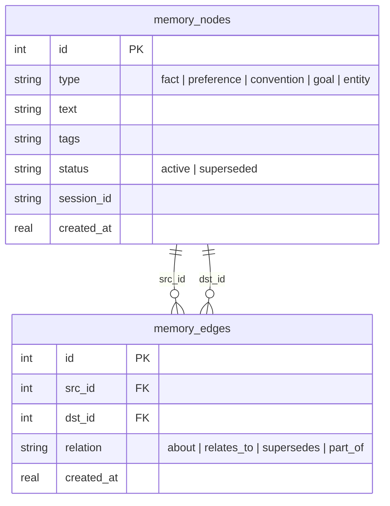

# Plan: Graph Structure for Long-Term Agent Memory

> Status: proposal, not implemented. Phase 0 (flat `memories` table,
> `src/ds_agent/agent_mcp.py`) shipped in PR #2. This doc plans what comes
> after, if/when it's actually needed — see Recommendation at the bottom.

## 1. Why the flat table isn't enough

The current `memories` table (`db.py`) is a flat, unordered list of text
blobs:

```sql
memories(id, text, tags, session_id, created_at)
```

`recall()` is a substring match over `text`/`tags`; the 30 most recent rows
are injected into every session's system prompt (`agent_prompt.py`). That's
fine at low volume, but has no structure once it grows:

- **No relationships.** "User prefers vectorbt over backtesting.py" and
  "backtesting.py's slippage model caused a bug last week" are about the
  same topic but stored as two unrelated rows — nothing lets the agent
  pull "everything about backtesting.py" as one unit.
- **No entities.** Recurring subjects (a dataset, a provider, a trading
  strategy) aren't first-class — they only exist as substrings inside
  free text, so "what do we know about the BTC-USD dataset" only works if
  every relevant memory happens to contain that exact string.
- **No supersession.** If a preference changes, the old row just sits
  there. Both the outdated and current preference get injected into the
  prompt with no signal which one is current — a real correctness risk,
  not just clutter.
- **Recency-only ranking.** The top-30 cutoff is purely by `created_at`,
  so an entity/topic that hasn't been touched recently silently drops out
  of the automatic injection regardless of importance.

## 2. Proposed model

Keep it in SQLite — no new infra. Two tables instead of one:

```sql
CREATE TABLE memory_nodes (
    id          INTEGER PRIMARY KEY AUTOINCREMENT,
    type        TEXT NOT NULL DEFAULT 'fact',   -- fact | preference | convention | goal | entity
    text        TEXT NOT NULL,
    tags        TEXT,
    status      TEXT NOT NULL DEFAULT 'active', -- active | superseded
    session_id  TEXT,
    created_at  REAL NOT NULL
);

CREATE TABLE memory_edges (
    id          INTEGER PRIMARY KEY AUTOINCREMENT,
    src_id      INTEGER NOT NULL REFERENCES memory_nodes(id) ON DELETE CASCADE,
    dst_id      INTEGER NOT NULL REFERENCES memory_nodes(id) ON DELETE CASCADE,
    relation    TEXT NOT NULL,  -- about | relates_to | supersedes | part_of
    created_at  REAL NOT NULL
);
```



Example: an `entity` node for "BTC-USD backtest strategy" with two `fact`
nodes linked to it via `about` edges, and a `preference` node linked via
`supersedes` to an older, now-`superseded` preference node.

A dedicated graph database (Neo4j, etc.) is explicitly **out of scope** —
traversal here never needs more than 1-2 hops, which a couple of SQL joins
or a recursive CTE handle fine. Bringing in a second datastore for a
single-user personal tool would be the wrong trade.

## 3. Tool surface changes

- `remember(text, tags="", type="fact", about="")` — `type` classifies the
  node; `about` optionally names an entity (creating it if it doesn't
  already exist by exact/near-match name) and adds an `about` edge.
- `relate(src_id, dst_id, relation)` — new tool for the agent to explicitly
  link two existing memories (e.g. mark one as `supersedes` another instead
  of just calling `remember` again).
- `recall(query="", entity="", include_related=True)` — `entity` returns
  that entity node plus everything linked to it; `include_related` walks
  one hop out from any direct text/tag match too. Plain `recall(query)`
  keeps working exactly as it does today (backward compatible).
- `forget(memory_id)` unchanged. Prefer `relate(new_id, old_id, "supersedes")`
  over `forget` when a preference changes — it keeps history instead of
  destroying it, and lets prompt injection exclude the superseded node
  without losing the audit trail.

## 4. Prompt injection changes

`build_append_system_prompt()` currently injects the 30 most recent rows,
full stop. Under the graph model it should instead:
1. Filter to `status = 'active'` only (superseded nodes never show).
2. Group/cap per `type` (e.g. up to 10 preferences, 10 conventions, 5
   goals) so one noisy category can't crowd out the others — a flood of
   `fact` nodes about one dataset shouldn't push out a standing
   `preference`.
3. Optionally pull in an entity's most-referenced facts rather than pure
   recency, once there's enough real data to justify it (see §6).

## 5. Migration plan (phased, each phase independently shippable)

| Phase | Change | Breaking? |
|---|---|---|
| 0 (done, PR #2) | Flat `memories` table, substring `recall`. | — |
| 1 | Add `type`/`status` columns to the existing table (`ALTER TABLE`, defaults `'fact'`/`'active'`); `remember()` gains an optional `type` param. No edges yet. | No — old rows just default to `type='fact'`, `status='active'`. |
| 2 | Add `memory_edges` table + `relate()` tool; `recall()` gains `entity=`/`include_related=`. | No — additive; old `recall(query)` calls behave identically. |
| 3 | Wire `supersedes` into prompt injection (§4 point 1); teach the agent (via the `remember`/`relate` tool docs) to prefer `relate(..., "supersedes")` over a bare new `remember()` when correcting a stored preference. | No, but changes *behavior* — some previously-shown memories stop being injected once marked superseded. |
| 4 (speculative) | A periodic self-review pass (agent-triggered or scheduled) that scans the graph for likely duplicate/stale nodes and proposes supersession. | Not committed — needs real usage data first. |

Each phase is additive to the schema and tool surface, so there's no
big-bang rewrite and no downtime.

## 6. Open questions / risks

- **Entity de-duplication is itself a judgment call.** Nothing stops the
  agent from creating both a "BTC-USD" and a "Bitcoin dataset" entity node
  for the same thing. `about` should do a fuzzy/substring match against
  existing entity names before creating a new one, but this won't be
  perfect — worth watching once real data exists.
- **No semantic retrieval.** Traversal and `recall` still only match on
  literal text/tag/entity-name overlap. A future layer (e.g. `sqlite-vec`
  embeddings) could sit on top of this schema without changing it, but
  that's a separate, later effort.
- **Complexity vs. actual benefit.** As of this writing the `memories`
  table is empty in production (PR #2 hasn't been deployed yet) — there is
  no real usage data showing the flat list is actually a problem. Building
  Phase 2/3 (edges, entities, supersession) before that evidence exists
  risks over-engineering a feature nobody has stressed yet.

## 7. Recommendation

Ship **Phase 1 only** for now — it's a cheap, non-breaking schema change
that already solves the sharpest correctness issue (an outdated preference
sitting next to its replacement with no way to tell which is current,
once Phase 3's status filtering is added on top of it). Hold Phases 2-4
until the memory table has enough real entries that "everything about
project X" is a query someone actually needs — building the graph/entity
layer before that is speculative complexity the project doesn't need yet.
