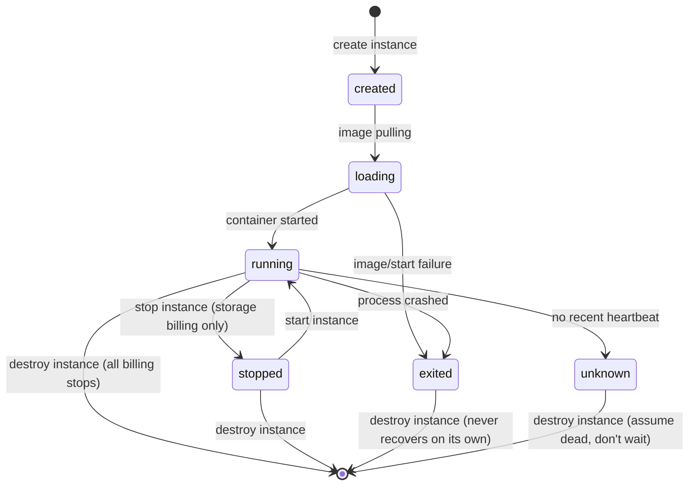

# Plan: Vast.ai MCP (a second, SSH-free compute backend alongside Colab)

> Status: proposal, not implemented. Grounded by downloading and reading the
> real `vastai` PyPI package (v1.7.0, MIT) — `vastai/sdk.py`, `vastai/api/*.py`,
> and its bundled `SKILL.md` — rather than guessing at the API surface, the
> same approach used for the `colab_mcp` fixes. See Recommendation at the
> bottom before implementing.

## 1. Why add this alongside the existing Colab MCP

`colab_mcp` already gives the agent GPU/TPU compute, so this needs a real
reason to exist, not just "another provider":

- **No OAuth.** Vast.ai auth is a single static API key (`Authorization:
  Bearer <key>`), resolved by the real SDK from `VAST_API_KEY` env var first.
  That's a straight fit for this repo's existing BYOK vault pattern
  (`${VAULT:vast}` in `mcp.json`, exactly like `kaggle`/`FRED_API_KEY`) —
  none of the PKCE/OAuth-flow complexity (and the bugs it caused — see
  `docs/debug_notes.md` 2026-09-14) that Colab needs.
- **A real marketplace, not one fixed tier.** Colab gives you whatever
  Google assigns from a small accelerator list at a subscription price;
  Vast.ai is a bidding marketplace across many hosts — `search offers`
  returns many concrete price/GPU/reliability combinations to actually
  choose from (see `search offers` flags in §2), including interruptible
  (spot) pricing below on-demand.
- **A real Docker container, not a notebook kernel.** Full root access, any
  image (not just Colab's kernel environment), no notebook-session-specific
  quirks to work around.
- **No proxy-token-expiry class of bug.** Nothing in the Vast.ai API
  resembles Colab's short-lived runtime proxy token (the bug fixed in
  `colab_server.py` — see `docs/debug_notes.md`) — auth is the same static
  Bearer key for the life of the instance, so there's no reconnect-token
  logic to get wrong here at all.

The real risk this backend introduces that Colab mostly doesn't: **direct,
uncapped-by-default hourly billing** the moment an instance reaches
`running`. Cost-safety has to be a first-class part of the tool design, not
an afterthought — see §5.

## 2. What the real API actually looks like

Confirmed by reading the SDK source directly (not docs alone):

- Base URL `https://console.vast.ai`, paths auto-prefixed `/api/v0/...`,
  auth header `Authorization: Bearer <api_key>`.
- `search offers` (`GET`, via `offers.search_offers`): query string like
  `"gpu_name=RTX_4090 num_gpus=1 verified=true"` (operators `=`,`!=`,`>`,
  `>=`,`<`,`<=`,`in`,`notin`); useful fields: `gpu_name`, `num_gpus`,
  `gpu_ram`, `dph_total` (price/hr), `reliability`, `geolocation`,
  `direct_port_count`; `type` is `on-demand` (default), `reserved`, or
  `bid` (spot — `create_instance` still bills on-demand unless you pass
  `bid_price` explicitly, a real footgun called out in the SDK's own
  `SKILL.md`).
- `create instance` (`PUT /asks/{offer_id}/`): takes `image`, `disk` (GB),
  `env`, `ssh`/`jupyter`/`direct` connection flags, optional `bid_price`.
  Returns `{"success": true, "new_contract": <instance_id>}`.
- `show instance(s)` (`GET`): returns `actual_status` — the state machine
  in §3 — plus `ssh_host`/`ssh_port`/`public_ipaddr` once running.
- `destroy instance` (`DELETE /instances/{id}/`) — permanent, stops all
  billing immediately. `stop instance` (`PUT /instances/{id}/` with
  `{"state": "stopped"}`) — halts GPU billing but **storage billing
  continues** until destroyed.
- **`execute` (`PUT /instances/command/{id}/` with `{"command": "..."}`,
  response has a `result_url` you poll with a plain `GET`) — a genuine
  synchronous-command API, no SSH involved at all.** The SDK's own default
  poll loop is `retries=30, delay=0.3` (~9s total), i.e. this is built for
  *quick* commands (`nvidia-smi`, a `pip install`, a status check), not for
  blocking on a multi-hour training run — see §3 for how to use it for long
  jobs anyway.

**Do not depend on the `vastai` PyPI package to get this.** It bundles the
*entire* CLI (billing, teams, deployments, PDF invoice generation via
`borb`, cloud-storage sync, …) behind one dependency list, and that list
pins `cryptography==49.0.0` — which hard-conflicts with this project's own
`cryptography>=50.0.0` pin (`pyproject.toml`) used for the BYOK vault
(`crypto.py`). Installing it into the main venv would break dependency
resolution; giving it its own venv (à la `colab_mcp`) would work but adds
real maintenance weight (a second `setup.sh`, a second `.venv` to keep in
sync) for functionality — HTTP calls with a bearer token — that doesn't
need it. **Re-implement the handful of endpoints above directly with
`requests`** (already a transitive dependency via `claude-agent-sdk`), the
same "thin wrapper, no exotic deps" shape as `ds_mcp`/`agent_mcp`/
`research_mcp` — no dedicated venv needed at all, unlike `colab_mcp`.

## 3. Instance lifecycle

The real API's own warning (confirmed in the SDK's `SKILL.md`, worth
repeating verbatim because it's the exact bug shape the Colab reconnect fix
in this repo just addressed for a different reason): if `actual_status`
becomes `exited`, `unknown`, or `offline` it **never reaches `running` on
its own** — a poll loop without a timeout and an explicit failure branch
spins forever while storage charges accrue. `vast_new`'s poll helper must
treat those three states as terminal failures, not "still starting."

**Long-running jobs without SSH**: since `execute`'s own poll timeout is
~9s, a training run has to be started detached and checked on later —
`vast_execute("nohup python train.py > /workspace/train.log 2>&1 &")`
returns immediately, then a later `vast_execute("tail -100 /workspace/train.log")`
checks progress. This is the same "agent polls, doesn't block" pattern
`colab_execute`/`ds_run` already use, just expressed as two `execute` calls
instead of one blocking one — no new primitive needed.

**Artifacts without SSH**: this repo already has the `__ARTIFACT__:kind:path`
convention (`artifact_parser.py`) for surfacing plots/files in the chat.
The executed remote code can emit them exactly the same way, and
`vast_execute`'s handler can fetch a *small* file back by having the
*next* command base64-print it (`print(base64.b64encode(open(p,'rb').read()).decode())`)
over the same `execute` API — no SSH needed for small artifacts/uploads.
Bulk file transfer (a large dataset) is the one place this genuinely falls
short of SSH/SCP — see Phase 2.

## 4. Proposed MCP tool surface

Same naming convention as `colab_mcp` (`colab_*`), so `vast_*`:

| Tool | Action |
|---|---|
| `vast_search_offers(gpu_name, num_gpus=1, max_price=None, min_reliability=None, region=None, spot=False)` | Query the marketplace; return top matches (id, price, gpu, reliability). |
| `vast_new(offer_id, image="pytorch/pytorch:@vastai-automatic-tag", disk_gb=20, bid_price=None)` | Create an instance from a specific offer (the agent should call `vast_search_offers` first and choose one, not auto-pick — price commitment should be visible in the conversation). Polls until `running` or a terminal failure state; returns instance id + status. |
| `vast_status(instance_id=None)` | Show one instance (or the active one) — status, price/hr, uptime so far. |
| `vast_sessions` | List all of the account's instances (mirrors `colab_sessions`). |
| `vast_execute(instance_id, command, timeout=60)` | Run a shell command via the real `execute` API; for anything long-running, use the detached `nohup ... &` + follow-up `tail` pattern from §3. |
| `vast_upload(instance_id, local_path, remote_path)` (Phase 1: small files only, via base64-over-`execute`) | Push a local file onto the instance. |
| `vast_install(instance_id, packages)` | `pip install` via `vast_execute`, same shape as `colab_install`. |
| `vast_stop(instance_id)` | Halt GPU billing, keep storage/disk (resumable). |
| `vast_destroy(instance_id)` | Permanently terminate — stops ALL billing. |

`vast_stop` vs `vast_destroy` being two separate, clearly-named tools
(rather than one "stop" tool with a "permanent" flag easy to leave at its
default) is deliberate — see §5.

## 5. Cost safety (the real risk this backend adds)

Unlike Colab (subscription-tier or free), a `running` Vast.ai instance
bills per hour immediately and by default has **no idle/inactivity
timeout at all** — nothing stops it running (and billing) for days if the
agent or the user simply forgets about it. This needs to be designed in,
not bolted on:

- `vast_new`'s tool description and the system-prompt guidance for it must
  state the hourly price back to the agent/user at creation time and
  explicitly remind that `vast_destroy` is required when done — `vast_stop`
  alone still bills for storage.
- Track "instance created at" + last-`vast_execute`-call time in
  `_state` (matching the process-local state pattern `colab_server.py`
  already uses for tokens); `vast_status`'s output should surface elapsed
  running time and estimated cost-so-far (`dph_total * hours`) every time
  it's called, not just on creation — a standing reminder, not a one-time
  warning that scrolls out of context.
- Consider (Phase 2, not committed): an idle-time watchdog analogous to
  `sessions.py`'s `TURN_INACTIVITY_TIMEOUT` pattern already in this
  codebase — if no `vast_execute` call has hit a given instance for N
  hours, proactively warn (or auto-`vast_stop`, never auto-`vast_destroy`
  without confirmation) rather than letting it bill silently forever.

## 6. Migration plan (phased, each phase independently shippable)

| Phase | Change | Needs SSH? |
|---|---|---|
| 1 | `src/vast_mcp/server.py` (new top-level package, main venv, no dedicated venv) implementing `vast_search_offers`/`vast_new`/`vast_status`/`vast_sessions`/`vast_execute`/`vast_install`/`vast_stop`/`vast_destroy` via raw `requests` calls to the endpoints in §2. `vast_upload` limited to small files via base64-over-`execute` (§3). BYOK `vast` provider wired into `mcp.json` as `env: {"VAST_API_KEY": "${VAULT:vast}"}`. Cost-safety per §5. | No |
| 2 (only if Phase 1's base64 upload proves too slow for real dataset sizes) | Real SCP/SSH-based `vast_upload`/`vast_download` for large files — needs a registered SSH keypair (`create ssh-key`, mirroring `colab_mcp/auth_once.py`'s one-time setup script) and an SSH client dependency (`paramiko`, or shelling out to the system `ssh`/`scp` binary — decide which when this phase is actually justified). | Yes |
| 3 (speculative) | Idle-timeout watchdog auto-`vast_stop` (§5), spot/bid-price re-bidding when outbid (`update instance --bid_price`, per the SDK's interruptible-pricing notes), volumes for data that should survive a `vast_destroy`. | No |

## 7. Open questions / risks

- **Base64-over-JSON for uploads is real but bounded.** Fine for a config
  file or a small CSV; a multi-GB dataset would be slow and wasteful this
  way. Phase 1 should cap `vast_upload`'s size and point at `vast_execute`
  + a direct download URL (`wget`/`curl` run remotely) as the better path
  when the source data already has one (e.g. a Kaggle/HF dataset URL) —
  genuinely the common case for this project already, not a hypothetical.
- **No integration test possible without a funded Vast.ai account.** Unlike
  the Colab PKCE/reconnect fixes (verifiable via mocks against the real
  pydantic models), an actual `vast_new` call costs real money the moment
  it reaches `running`. Implementation should be unit-tested against
  mocked HTTP responses (same shape as `test_kaggle_mcp_proxy.py`/
  `test_colab_mcp_reconnect.py` — request-building and response-parsing
  logic, no live account needed) but a first live smoke test still needs a
  human with a funded account and explicit go-ahead before `vast_new` is
  ever actually called for real.
- **Spot/bid pricing is an easy trap.** Per §2, `create_instance` defaults
  to on-demand pricing even after a `--type bid` search unless `bid_price`
  is passed explicitly — `vast_new`'s tool description needs to say this
  loudly, or the agent will silently rent at full price expecting a spot
  discount.

## 8. Recommendation

Ship **Phase 1 only**. It already delivers the full value proposition (real
marketplace pricing, root Docker access, no OAuth complexity) without
touching SSH at all, keeps the dependency footprint to plain `requests` in
the main venv (no second `colab_mcp`-style dedicated venv), and — most
importantly given §5 — ships with cost-visibility built into `vast_status`
from day one rather than bolted on later. Hold Phase 2 (SSH/SCP) until
Phase 1's base64 upload path has actually been hit with a dataset large
enough to hurt, and Phase 3 (idle watchdog, re-bidding) until there's a
human account actually running this in anger to know which of those is
worth building first.
